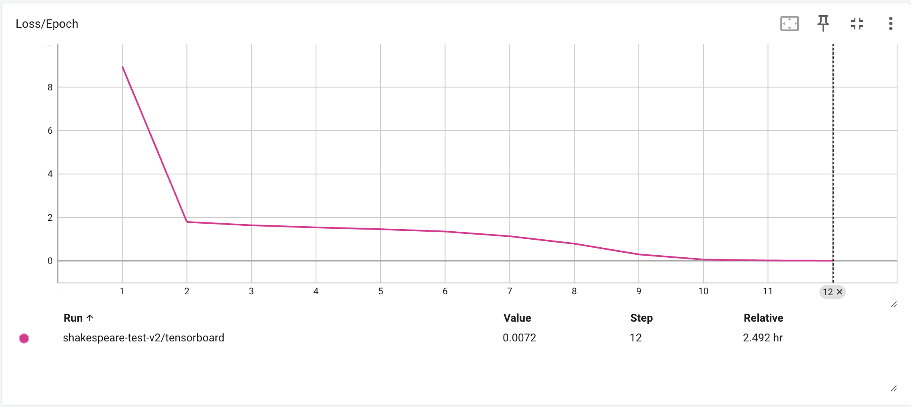

# code-completion

- 5 nov 2024
  - Just doing some research about code completion.
  - Current idea for data gathering: Scrape github but filter on the following criteria:
    - Repo with >100 stars
    - Only python code, the repo must contain mostly python code also
    - Small files: >100 bytes but <100 kb maybe? Paper did 100mb
  - Yes
- 7 nov
  - more stuff
  - https://github.com/search?q=language%3APython+size%3A5..5000+stars%3A%3E%3D100+license%3AMIT+template%3Afalse&type=repositories
  - https://github.com/search?q=language%3APython+size%3A5..5000+stars%3A%3E%3D100+template%3Afalse&type=repositories
- 8 nov
  - Take a break from transformers, do some scraping!
  - See `scraping/`
  - Github api requests, switch out PATs for higher ratelimits
  - Scrape repos with the following criterion: >100 stars, python.
  - Do in sections of months to get around the max 1000 results constraint
  - So we have 30k of all python repositories since 2015
  - Then scrape files, just .py files between 1 and 100 kb, using SHA to avoid reuse
- 9 nov
  - Okay, actually working really hard on transformers now.
  - We have the dataset, now I'm fixing up architecture, making training etc files
  - Using BERT for tokenizing.
  - This project is really starting to come along!
  - Made eval.py and I am testing on a shakespeare dataset because its smaller for now
  - Fixed bugs with it always predicting `[PAD]`
  - I think I will have to train it for a bit on shakespeare and see what I get
  - Integrated tensorboard is bugging, so I open it on web now
  - Nans in stuff, which I had to fix
  - BRUH ok so the reason why it was generating a bunch of unused tokens was because I forgot to set vocab size
  - But now that I've done it, it's working great! Here's some example generated shakespeare: `It is it mumle asch my farewell as together with dec within specialising hannibal glittering plea northern hale withindes iv more transit villains exeunt jaws men fearful trunk wo fertile togetheryr assignent moons . fellowyr hez rivers together translationstton neither most hearts nephew it rests virtuepl patterns make manson elves advocacy old firstous un same pole let ex pleasure monument presumably tis en is sparkle minds faithful polonius phil is fiery exeter germany give bed high high itbit most peace demonstration rescued thoughts why lords exeu`
  - And that was after 12 minutes of training!
  - I'm going to train it on code, but I think we should be in a good spot and we might be able to train it on wikipedia and have something of a chatgpt. That would be quite something.
- 11 nov
  - Ok, so I trained it overnight on code, and we've got NaN's in the loss!
  - Quite unfortunate, but I think I will pivot and make a TrainingManager class becuase train.py is becoming too big. Also, I will deNaN in there.
  - The current plan is just to train on shakespeare as a test. Why? Because it's small and highly specific. We can use shakespeare to test if the model can really learn and "overfit" to Shakespeare's style. Wish me luck!
  - Even on the shakespeare, these things do take a while to train. Epoch 13 in 2 hr 30 min. Loss curve is looking kind of funny: epoch zero is super high, then it went down to 1 and stayed there, and then suddenly jumped down to like 0.02. Picture: 
  - it goes a lot faster when I close all the other apps and turn off the screen, understandably. (Up to epoch 18 just 45 minutes later)
  - I'm considering using wandb, but tensorboard does all I need in terms of making little graphs of loss curves.
  - Inference is still trash: (shakespeare) `Prompt: I am - Completion: faith tern- ndhelen thee more first serious gi and instances cleopatra taffhere`
  - Feels pretty much the same as the sample up above
  - Epoch 20 and loss is at 0.001
  - Beginning to kind of learn sentence structures: `This is king this discovers hall for readiness dansister service old all chamber william usually ab promising soi linen ousostrather hall olivia monument most nmarcus robert applebeauty bride all caesar ' s ex eusort cha because ' usher doolivia old camouflage`
  - Loss is going down, sentences are incoherent, but its picking up on shakespearean words: `Forsooth for silvia weep is sour though xiii exeter crack fee dread with ackthere lstaffforward wears suit safety de count gods spa but lai clarence exeter up remain intex utterly un messengers madam old wo messengers wo old painter additions here several join but music edthe apartments watch dold ex bi youth most old`
  - There might be some Richard III overfitting: "exeter", "clarence", "messengers"
  - Still, that's what we are aiming for
  - While it hasn't really picked up on sentence structure, shakespeare itself as somewhat confusing structure as well.
  - Current loss is 0.0015, we are 28 epochs and 5.5 hours in.
  - Ok, well the Nan check flagged but bug caused it to just error and exit. My tensorboard is being weird too. Sample: `I am crantmore ultultbelong tis honest loved above though bitter gone hat sir was love old tutor er s en marcel more assurance destroy old aex euntpalaces fast old death ex euntas chase t des old friend tis spells death old ( lfla corner most sunshine mates barren lo aththgreat plotted wounds besides ] beside s messengers roast fairly gone uearth said horse quo good nceold breast la`
  - Loss is going up also so that's a sign I stop. This also looks worse than the epoch 20 checkin. Well, that wasn't exactly reassuring.
- 16 nov

  - Took a few-day break from this, no clear quickfix. As a sanity check, I will train with the trainer from https://github.com/sgrvinod/a-PyTorch-Tutorial-to-Transformers, and then see if it works and go from there. Should have probably done this sooner, but oh well.
  - Alright. I've cloned it over, but I will keep notes here. Fork is @ https://github.com/JBlitzar/a-PyTorch-Tutorial-to-Transformers

    - Within the subquest of getting this to work, here's what I've done so far:
    - Rename directories to work with my naming scheme
    - reset model checkpoint
    - Add a gitignore
    - Get data.
    - I'm about to train. Idea is to see if this works, then get it to work on autoregression, then modify if wanted!
    - Quickly added tqdm to see progress.
    - This person really comments _every single line_. Case in point:

    ```python
    model.eval() # eval mode disables dropout
    # Prohibit gradient computation explicitly

    with torch.no_grad():

    ```

    - Oh my goodness this guy made his own "sequenceloader" which _doesn't inherit from dataloader_ and forgot utility methods like `__len__`. I guess I'll add them so tqdm actually works!
    - We're looking at 13h epochs. Only 24gb ram used, I'll turn that up and crank overnight. _This is why tqdm is useful. We can look at how long things like this take and react._
    - Added caffeinate
    - Something is weird. Actmon says 81 gb used, 8gb real and 478gb virtual. Shared and private are either small or negative. 
    - What do you know, MPS backend got OOM. Rather than debug this, I'm going to pivot and try to get https://github.com/tunz/transformer-pytorch working. Repo is clean and consice. Author seems like they know the paper inside and out, given they wrote https://tunz.kr/post/4.

  - Side-quest 2: Getting https://github.com/tunz/transformer-pytorch to work
    - Idiosyncratic #1: Bro uses his own library for custom pytorch operations _implemented in c++_
    - Cool, kind of a pain for the rest of us for one function. https://github.com/tunz/tcop-pytorch/tree/master
    - So only uses tcop in fast_transformer.py, that's also the only difference. https://tunz.kr/post/5 says that it was only 2% faster, so whatever. Kind of sad he went on this whole quest to rewrite a torch op in c++ and it only got 2% faster. Why? He analyzed one area: MHA. I'm absolutely sure that the main time crunch is backprop and Linear. Also when rewriting a couple operators into one vs using pytorch's very optimized ones in succession, you will get similar results
    - It's also designed for autoregression.
    - Dataloading is a bit convoluted, but for now I will trust the process.
    - Quickfixes of recasting to bool bc mps, did weights_only for security
    - Looking up! 20 min epochs, and I will analyze via tensorboard.
    - Did a few fixes with deserialization, and started training. Tensorboard is very fun. Mem usage is actually perfect. TBH, this is how I would've structured the project. Good job tunz 5 years ago! You've earned yourself a star.

- 17 nov
  - We are still working on our fork at https://github.com/jblitzar/transformer-pytorch to work.
  - Loss is around 3.5
  - After training overnight and doing some decoding, we get for the result `[This is] one of the world 's most successful companies . <eos>` (prompt in brackets).
  - Pretty great!
  - Says some interesting things.
    - `[I am not] the only person who has been arrested . <eos>`
    - `[The trees] have been destroyed in a blaze at a house in <unk> . <eos>` (Does this on anything related to trees)
    - `[He is] one of the world 's most successful companies . <eos>` Indicates overfitting on that phrase
    - `[I am trying to] find a solution to the problem . <eos>`
    - `[She is a person who] has a lot to learn from . <eos>` Finally not a company completion. Using "she" might lead the model away from overfitting male-gendered pronouns to stereotypical business-related completions. Compare with `[He is a person who] has a lot of experience and experience . <eos> . . <eos>`
    - `[It is an example of] the <unk> of <unk> . <eos>` Lots of unk
    - `[The idea is to] create a " <unk> " system that allows people to use the internet to communicate with friends . <eos>` Interesting. News articles seem very company and social-media focused.
    - `[The meaning of life is] not the same . <eos>`
    - `[The secret is] one of the world 's most popular <unk> . <eos>`
    - `[Success is] one of the world 's most successful companies . <eos>` Broke the streak!
    - `[A person is] not the only person who has been arrested . <eos>` The arrested one again.
    - `[An animal is] one of the world 's most endangered species . <eos>` Makes sense, quite vague
    - `[He is not] the only one of the most popular <unk> in the world . <eos>` It was going for the company one, wasnt it.
  - I generated some more after a bit, and it's interesting.
    - `[illegal] immigration is a major problem in the united states . <eos>` The news is showing :\
    - `[aawoipehaweio apiouhguivcnxn] , a spokesman for <unk> , said the company had not yet been notified . <eos>`. Does this for all unknown tokens I'm pretty sure. See `[Interesting] <unk> , a spokesman for <unk> , said : " we are pleased to announce that we have reached a new agreement with <unk> . <eos>`. `[Example] <unk> , a spokesman for <unk> , said : " we are pleased to announce that we have reached a new agreement with <unk> . <eos>`
    - `[Climate change is] a good thing . <eos>` Extremely worrying
    - `[The internet is] one of the world 's largest internet companies . <eos> <eos>` ok.
    - `[What is the] leading provider of <unk> , <unk> , <unk> , <unk> , <unk> , <unk> , <unk> , <unk> , <unk> , <unk> , <unk> , <unk> , <unk> , <unk> , <unk> , <unk> , <unk> , <unk> , <unk> , <unk> , <unk> , and <unk> , <unk> , <unk> , <unk> , <unk> , <unk> , <unk> , <unk> , <unk> , <unk> , <unk> , <unk> , <unk> , <unk> , <unk> , <unk> , <unk> , <unk> , <unk> , <unk> , <unk> , <unk> , <unk> , <unk> , <unk> , <unk>` The unknown tokens.
    - `[The economy] , which has been hit hard by the credit crunch , has been hit hard by the recession . <eos>` Very news-related.
    - What's with the violence: `[This man] , who has been in custody for more than a year , was arrested on suspicion of causing grievous bodily harm . <eos>`
    - `[You are] not the only ones that have been affected . <eos> <eos>`
    - `[Welcome to] be the first person to win a gold medal at the beijing olympics . <eos>`
    - `[This is the only] person who has been charged in the case . <eos>` so much legal/arrest stuff
    - `[There is hope that] this will be the end of the year . <eos>`
  - To be added to. Might consider top-p sampling or increasing temeperature or something from the current method of beam search, whatever that is. Somehow get rid of `<unk>`. Keep training for now.
