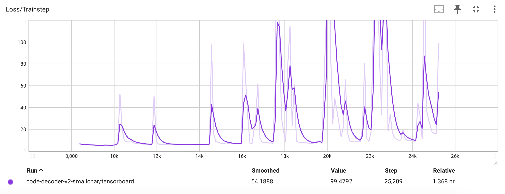
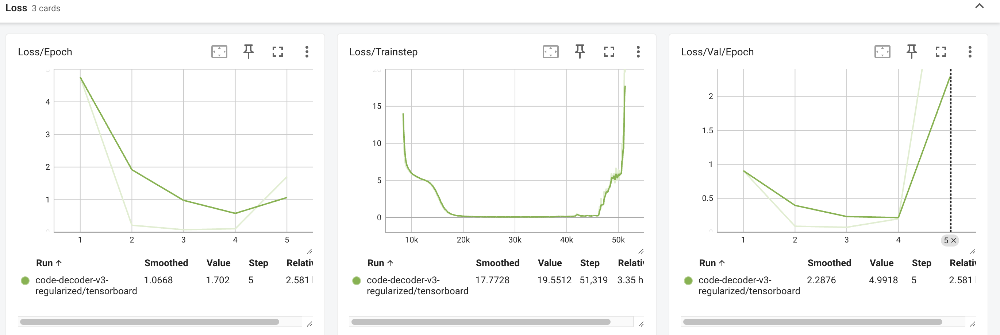

# code-completion

- 5 nov 2024
  - Just doing some research about code completion.
  - Current idea for data gathering: Scrape github but filter on the following criteria:
    - Repo with >100 stars
    - Only python code, the repo must contain mostly python code also
    - Small files: >100 bytes but <100 kb maybe? Paper did 100mb
  - Yes
- 7 nov
  - more stuff
  - https://github.com/search?q=language%3APython+size%3A5..5000+stars%3A%3E%3D100+license%3AMIT+template%3Afalse&type=repositories
  - https://github.com/search?q=language%3APython+size%3A5..5000+stars%3A%3E%3D100+template%3Afalse&type=repositories
- 8 nov
  - Take a break from transformers, do some scraping!
  - See `scraping/`
  - Github api requests, switch out PATs for higher ratelimits
  - Scrape repos with the following criterion: >100 stars, python.
  - Do in sections of months to get around the max 1000 results constraint
  - So we have 30k of all python repositories since 2015
  - Then scrape files, just .py files between 1 and 100 kb, using SHA to avoid reuse
- 9 nov
  - Okay, actually working really hard on transformers now.
  - We have the dataset, now I'm fixing up architecture, making training etc files
  - Using BERT for tokenizing.
  - This project is really starting to come along!
  - Made eval.py and I am testing on a shakespeare dataset because its smaller for now
  - Fixed bugs with it always predicting `[PAD]`
  - I think I will have to train it for a bit on shakespeare and see what I get
  - Integrated tensorboard is bugging, so I open it on web now
  - Nans in stuff, which I had to fix
  - BRUH ok so the reason why it was generating a bunch of unused tokens was because I forgot to set vocab size
  - But now that I've done it, it's working great! Here's some example generated shakespeare: `It is it mumle asch my farewell as together with dec within specialising hannibal glittering plea northern hale withindes iv more transit villains exeunt jaws men fearful trunk wo fertile togetheryr assignent moons . fellowyr hez rivers together translationstton neither most hearts nephew it rests virtuepl patterns make manson elves advocacy old firstous un same pole let ex pleasure monument presumably tis en is sparkle minds faithful polonius phil is fiery exeter germany give bed high high itbit most peace demonstration rescued thoughts why lords exeu`
  - And that was after 12 minutes of training!
  - I'm going to train it on code, but I think we should be in a good spot and we might be able to train it on wikipedia and have something of a chatgpt. That would be quite something.
- 11 nov
  - Ok, so I trained it overnight on code, and we've got NaN's in the loss!
  - Quite unfortunate, but I think I will pivot and make a TrainingManager class becuase train.py is becoming too big. Also, I will deNaN in there.
  - The current plan is just to train on shakespeare as a test. Why? Because it's small and highly specific. We can use shakespeare to test if the model can really learn and "overfit" to Shakespeare's style. Wish me luck!
  - Even on the shakespeare, these things do take a while to train. Epoch 13 in 2 hr 30 min. Loss curve is looking kind of funny: epoch zero is super high, then it went down to 1 and stayed there, and then suddenly jumped down to like 0.02. Picture: 
  - it goes a lot faster when I close all the other apps and turn off the screen, understandably. (Up to epoch 18 just 45 minutes later)
  - I'm considering using wandb, but tensorboard does all I need in terms of making little graphs of loss curves.
  - Inference is still trash: (shakespeare) `Prompt: I am - Completion: faith tern- ndhelen thee more first serious gi and instances cleopatra taffhere`
  - Feels pretty much the same as the sample up above
  - Epoch 20 and loss is at 0.001
  - Beginning to kind of learn sentence structures: `This is king this discovers hall for readiness dansister service old all chamber william usually ab promising soi linen ousostrather hall olivia monument most nmarcus robert applebeauty bride all caesar ' s ex eusort cha because ' usher doolivia old camouflage`
  - Loss is going down, sentences are incoherent, but its picking up on shakespearean words: `Forsooth for silvia weep is sour though xiii exeter crack fee dread with ackthere lstaffforward wears suit safety de count gods spa but lai clarence exeter up remain intex utterly un messengers madam old wo messengers wo old painter additions here several join but music edthe apartments watch dold ex bi youth most old`
  - There might be some Richard III overfitting: "exeter", "clarence", "messengers"
  - Still, that's what we are aiming for
  - While it hasn't really picked up on sentence structure, shakespeare itself as somewhat confusing structure as well.
  - Current loss is 0.0015, we are 28 epochs and 5.5 hours in.
  - Ok, well the Nan check flagged but bug caused it to just error and exit. My tensorboard is being weird too. Sample: `I am crantmore ultultbelong tis honest loved above though bitter gone hat sir was love old tutor er s en marcel more assurance destroy old aex euntpalaces fast old death ex euntas chase t des old friend tis spells death old ( lfla corner most sunshine mates barren lo aththgreat plotted wounds besides ] beside s messengers roast fairly gone uearth said horse quo good nceold breast la`
  - Loss is going up also so that's a sign I stop. This also looks worse than the epoch 20 checkin. Well, that wasn't exactly reassuring.
- 16 nov

  - Took a few-day break from this, no clear quickfix. As a sanity check, I will train with the trainer from https://github.com/sgrvinod/a-PyTorch-Tutorial-to-Transformers, and then see if it works and go from there. Should have probably done this sooner, but oh well.
  - Alright. I've cloned it over, but I will keep notes here. Fork is @ https://github.com/JBlitzar/a-PyTorch-Tutorial-to-Transformers

    - Within the subquest of getting this to work, here's what I've done so far:
    - Rename directories to work with my naming scheme
    - reset model checkpoint
    - Add a gitignore
    - Get data.
    - I'm about to train. Idea is to see if this works, then get it to work on autoregression, then modify if wanted!
    - Quickly added tqdm to see progress.
    - This person really comments _every single line_. Case in point:

    ```python
    model.eval() # eval mode disables dropout
    # Prohibit gradient computation explicitly

    with torch.no_grad():

    ```

    - Oh my goodness this guy made his own "sequenceloader" which _doesn't inherit from dataloader_ and forgot utility methods like `__len__`. I guess I'll add them so tqdm actually works!
    - We're looking at 13h epochs. Only 24gb ram used, I'll turn that up and crank overnight. _This is why tqdm is useful. We can look at how long things like this take and react._
    - Added caffeinate
    - Something is weird. Actmon says 81 gb used, 8gb real and 478gb virtual. Shared and private are either small or negative. 
    - What do you know, MPS backend got OOM. Rather than debug this, I'm going to pivot and try to get https://github.com/tunz/transformer-pytorch working. Repo is clean and consice. Author seems like they know the paper inside and out, given they wrote https://tunz.kr/post/4.

  - Side-quest 2: Getting https://github.com/tunz/transformer-pytorch to work
    - Idiosyncratic #1: Bro uses his own library for custom pytorch operations _implemented in c++_
    - Cool, kind of a pain for the rest of us for one function. https://github.com/tunz/tcop-pytorch/tree/master
    - So only uses tcop in fast_transformer.py, that's also the only difference. https://tunz.kr/post/5 says that it was only 2% faster, so whatever. Kind of sad he went on this whole quest to rewrite a torch op in c++ and it only got 2% faster. Why? He analyzed one area: MHA. I'm absolutely sure that the main time crunch is backprop and Linear. Also when rewriting a couple operators into one vs using pytorch's very optimized ones in succession, you will get similar results
    - It's also designed for autoregression.
    - Dataloading is a bit convoluted, but for now I will trust the process.
    - Quickfixes of recasting to bool bc mps, did weights_only for security
    - Looking up! 20 min epochs, and I will analyze via tensorboard.
    - Did a few fixes with deserialization, and started training. Tensorboard is very fun. Mem usage is actually perfect. TBH, this is how I would've structured the project. Good job tunz 5 years ago! You've earned yourself a star.

- 17 nov

  - We are still working on our fork at https://github.com/jblitzar/transformer-pytorch to work.
  - Loss is around 3.5
  - After training overnight and doing some decoding, we get for the result `[This is] one of the world 's most successful companies . <eos>` (prompt in brackets).
  - Pretty great!
  - Says some interesting things.
    - `[I am not] the only person who has been arrested . <eos>`
    - `[The trees] have been destroyed in a blaze at a house in <unk> . <eos>` (Does this on anything related to trees)
    - `[He is] one of the world 's most successful companies . <eos>` Indicates overfitting on that phrase
    - `[I am trying to] find a solution to the problem . <eos>`
    - `[She is a person who] has a lot to learn from . <eos>` Finally not a company completion. Using "she" might lead the model away from overfitting male-gendered pronouns to stereotypical business-related completions. Compare with `[He is a person who] has a lot of experience and experience . <eos> . . <eos>`
    - `[It is an example of] the <unk> of <unk> . <eos>` Lots of unk
    - `[The idea is to] create a " <unk> " system that allows people to use the internet to communicate with friends . <eos>` Interesting. News articles seem very company and social-media focused.
    - `[The meaning of life is] not the same . <eos>`
    - `[The secret is] one of the world 's most popular <unk> . <eos>`
    - `[Success is] one of the world 's most successful companies . <eos>` Broke the streak!
    - `[A person is] not the only person who has been arrested . <eos>` The arrested one again.
    - `[An animal is] one of the world 's most endangered species . <eos>` Makes sense, quite vague
    - `[He is not] the only one of the most popular <unk> in the world . <eos>` It was going for the company one, wasnt it.
  - I generated some more after a bit, and it's interesting.
    - `[illegal] immigration is a major problem in the united states . <eos>` The news is showing :\
    - `[aawoipehaweio apiouhguivcnxn] , a spokesman for <unk> , said the company had not yet been notified . <eos>`. Does this for all unknown tokens I'm pretty sure. See `[Interesting] <unk> , a spokesman for <unk> , said : " we are pleased to announce that we have reached a new agreement with <unk> . <eos>`. `[Example] <unk> , a spokesman for <unk> , said : " we are pleased to announce that we have reached a new agreement with <unk> . <eos>`
    - `[Climate change is] a good thing . <eos>` Extremely worrying
    - `[The internet is] one of the world 's largest internet companies . <eos> <eos>` ok.
    - `[What is the] leading provider of <unk> , <unk> , <unk> , <unk> , <unk> , <unk> , <unk> , <unk> , <unk> , <unk> , <unk> , <unk> , <unk> , <unk> , <unk> , <unk> , <unk> , <unk> , <unk> , <unk> , <unk> , and <unk> , <unk> , <unk> , <unk> , <unk> , <unk> , <unk> , <unk> , <unk> , <unk> , <unk> , <unk> , <unk> , <unk> , <unk> , <unk> , <unk> , <unk> , <unk> , <unk> , <unk> , <unk> , <unk> , <unk> , <unk> , <unk>` The unknown tokens.
    - `[The economy] , which has been hit hard by the credit crunch , has been hit hard by the recession . <eos>` Very news-related.
    - What's with the violence: `[This man] , who has been in custody for more than a year , was arrested on suspicion of causing grievous bodily harm . <eos>`
    - `[You are] not the only ones that have been affected . <eos> <eos>`
    - `[Welcome to] be the first person to win a gold medal at the beijing olympics . <eos>`
    - `[This is the only] person who has been charged in the case . <eos>` so much legal/arrest stuff
    - `[There is hope that] this will be the end of the year . <eos>`
    - `[h] & r block , which owns the company , said it had agreed to pay $ <unk> million to settle the lawsuit . <eos>`. Google searches reveal that there was a lawsuit in nov 2024, but also a bunch previously.
    - At least `[war] is not the answer . <eos>`
    - `[I'm wondering if] it 's a good thing . <eos>`
    - `[The question is] , what do you think ? <eos>`
    - `[google] , the world 's largest internet search engine , said it was looking at ways to make it easier for people to access the internet . <eos>` Actually good, prob overfit, but google search result for that exact sentence doesnt show anything.
    - `[He was] the first person to be killed in the attack . <eos>` Always violence. Same with [She was]
    - `[The trees in the rainforest are] also being planted . <eos>`
    - `[I am sure that] this will be the case . <eos>`
    - Loss is 3.9. Now its 3.5, 3.9 on val.
  - According to chatgpt: "Your findings are fascinating and provide a clear picture of how the lm1b dataset has influenced your model's behavior. The outputs show a distinct news-style bias with a strong leaning toward legal, corporate, and environmental themes, as well as frequent reliance on `<unk>` tokens when specificity fails."
  - To be added to. Might consider top-p sampling or increasing temeperature or something from the current method of beam search, whatever that is. Somehow get rid of `<unk>`. Keep training for now.
  - So what are the things we might change? Perhaps different sampling method, or continue generating past one sentence. Use `youtokentome` for tokenizing: The data preprocessing took suspiciously long, and `torchtext` is really jank.
  - I ended the run at epoch 100, as val loss tipped up and no change in train loss.

  - All right, so first of all we can see that they are tokenizing at the word level.
  - I'm going to try to get wikitext working. It's small, factual, and neutral. https://huggingface.co/datasets/Salesforce/wikitext.

- Nov 19
  - Nick thoughts:
    - Sometimes just a stack of decoders, no XA just SA. Look into it.
    - Mini autoencoder in feedforward.
    - Look through https://github.com/hyunwoongko/transformer
    - Preprocess code dataset by formatting or something.
      - Prob black. Tokenization might be interesting
  - Next steps: Research decoder stack, get proper tokenization, port tunz code over here, decide what to run it on (code completion probably)
    - Decoder only transformers are just a stack of decoders (no XA ofc)
    - https://datascience.stackexchange.com/questions/104179/is-the-transformer-decoder-an-autoregressive-model
      - Teacher forcing at training, just use actual token not predicted token, duh.
    - Decoder-only architecture opens it up as a classifier. Just knowing that it can be used for non-sequence stuff.
- Nov 21
  - 75 min session.
    - Just got decoder-only xformer implemented.
    - Also got dataset working!
- Nov 22:
  - Getting dataset working for more code-specific things, also reformatted all the files.
  - removed "T" hack (from future self: I basically added it back in because YTTM tried to do whitespace norm :\ )
  - I adjusted coverage, because someone put like a unicode dump and there were 14k unique chars
    - After some more investigation, it isnt unicode dumps, its lots of comments in chinese, cuz so many chinese characters.
    - AHAHAWHAfpesao9hasperugha me when I forget to set a flag that I created and then my code doesnt run removing chinese characters
    - Nevermind, I'll just use coverage variable like I initially planned. Silly me with no flag.
  - Switched to autopep8 because black was being weird
  - Got it to work, and realized that YTTM does whitespace normalization. Fine usually, not fine rn.
  - Autopep8 needs to ignore E402, duh, which moves imports to the top.
  - Stoped caching chunked file and instead cached pre-chunked, pytorch loads it faster. idk, prob overhead with delimeters or something.
    - But it's actually crazy. 76 vs 0.05 seconds to load.
  - Loading data finally works, just did a quickfix on tensor-ifying attn_mask also.
  - Train.py runs! Never have I ever spent so many hours on dataset.py (like 3 or 4. crazy.). I suppose also first time I used custom dataset.
- Nov 23:
  - Ahaa so I thought I was good and I made the rookie error AGAIN of not setting vocab_size. I added a check if its default to print a warning.
  - Reworked saving so that it saves best only.
  - Maybe examine loss before letting it go overnight.
    - In the spirit of testing, I'm going to run it on a minibatch and make sure val stuff works.
    - Done, now retrain.
  - Looking through https://github.com/hyunwoongko/transformer/blob/master/models/blocks/decoder_layer.py, the only other thing I missed was dropout.
  - Made a decision to do only 70 chars for that 99%. Should be fine.
  - Running train.py code-decoder-v2-smallchar. Train loss is a lot smaller than when I don't reduce chars.
  - Loss is small, but it still has a ways to go: `for i in range(in s[i]) s[i]) s[i]) s[i]) s[i]) s[i]) _F _F .append( s[i]) s[i]) s[2] in range( in in in in s[i]) s[i]) s[i]) _func in in s[i]) s[i]) s[i]) s[i]) s[i]) s[i]) ] s[i]) s[i]) s[i]) s[i]) s[i]) s[i]) RIT s[i]) s[i]) tmp s[i]) s[i]) s[i]) s[i]) s[i]) s[i]) tmp s[i]) s[i]) s[i]) s[i]) s[i]) s[i]) tmp s[i]) s[i]) s[i]) s[i]) s[i]) tmp s[i]) tmp tmp s[i]) rgb .append( tmp tmp s[i]) s[i]) s[i]) _test, .append( tmp tmp s[i]) s[i]) s[i]) s[i]) NIST hy tmp tmp s[i]) s.to( s.to( s.to( tmp tmp s[i]) s[i]) NE NE hy s.to( 4 uidance s[i])`
  - Stopped training, changed to smaller context window. Retraining. Perhaps 99% was too restrictive. Later retry with 99.5%, but should be fine I guess for now.
- Nov 24
  - Ugh, more NaNs in the loss overnight.
  - Time for some ✨debugging✨ - Nans in loss come from nans in results - But there are no nans in labels or batch. - `torch.isnan(batch).any()` - Removing layernorm didnt help. - I'm going to use `torch.autograd.set_detect_anomaly(True)` - Did some funny

```python
    def forward_hook(module, input, output):
        if isinstance(output, tuple):
            return
        if torch.isnan(output).any() or torch.isinf(output).any():
            print(f"NaNs/Infs detected in {module}")

for module in net.modules():
    module.register_forward_hook(forward_hook)
```

- Continuing
  - So looks like MHA is the issue.
  - And what do you know, https://github.com/pytorch/pytorch/issues/21518
  - So yeah. Lets give that fix a try
  - Nope, it seems that NaNs in x are occuring before they even are in MHA_selfattn.
  - Ok, so it seems to be occuring when it comes out of the MultiHeadAttention.
  - The problem is I forgot to cast mask to float 🤦 (I think?)
  - Ran through val and no NaN.
- All right, going to retrain. Also lowered lr by a factor of 10 and it doesnt explode anymore, so good sign.
  - Its been 2 epochs, avg loss went from 11 to 35, weird spikes. I'll put screenshot. 
  - Weird spikes: Perhaps do some sort of weight initialization? See https://github.com/pytorch/examples/blob/main/word_language_model/model.py
  - Maybe LR is too low now that we actually diagnosed the nans as coming from my MHA.
  - https://github.com/hyunwoongko/transformer/blob/master/train.py Uses Xavier initialization and clips gradients, so I will.
- Starting up runs/code-decoder-v3-regularized
  - Training, sample: (bracketed prompt from dataset)

```python
    [
                          loss_ = self.gwta_loss(out, yss, m, grid_factor=np.power(2, idx))
                     else:
                          loss_ = m(out, yss)
                     loss += loss_
                     losses.append(loss_.item())

                loss.backward()
                self.optimizers.step()
    ]

                # -- Histd_ +', b as do ed single This to to update is update
                             #                             continue     last LR ed this ") ', training
     # if output if args.local_rank not arg e:
```

- Not quite there yet, but looking like code. optimizer.step() is indeed to update parameters, and it does involve training, so it's getting there.
- Nov 25

  - So loss went up after a bit. It's kind of weird. 
  - Loss went wayy up after it seemed like it was going well going down.
  - Maybe over-regularization? I'm going to implement the lr schedule that https://github.com/hyunwoongko/transformer does and I adjusted gradient clipping to a lower threshold (1.0 vs 10.0)
  - https://github.com/hyunwoongko/transformer also just trained it a lot longer
  - Learning is slower, loss is at 1.3, but its stable, which is good.
  - Loss is literally the same within 2 decimal places as it was 2 hrs ago. 3.22 or whatever. Sometimes with projects, after you've done all the learning and coding, the rest is like fine-tuning and training 1 million times, and that isn't super fulfilling. Transformers was really cool though, and I totally want to run this on wikitext.
  - So this is (maybe) a classic case of too-low learning rate and so it got stuck in local minimum. Fine line between overfitting and over-regularization.

    - Rerunning with higher LR.
    - `v5-enabled`.
    - aaand a factor of 10 on the lr was too much (loss of 7k after a few steps). Split the difference and go 0.0005
      - That was also too much and resulted in exploding gradients.
    - Hyperparameter tuning is _the worst._
    - 0.0003 seems to be converging faster but not exploding.
      - Aw man! It was looking good but it was not to last.
    - 0.0002?

      - Converging faster, which is good. Loss is 1.33 after 42 mins.
      - It seemes to have leveled off at 1.32 again, just quicker this time.

    - It's entirely possible that model is underpowered. Reports 19,711,760 params, but model size is tiny: 80 mb. Something going on?

    - Just for fun, let's train on wikitext.
      - Loss is 8 (now 7.6, now 7.2), yeah model is underpowered.
    - What are standard model sizes? Looks like 12 decoders and 768-sized embedding.
      - Previous was 6 decoders and 512 embedding.
    - Ok, so wikitext was a good source of inspiration. Let's rerun code decoder with bigger. This will inevitably come with more hparam tuning
    - Training `v6-big`
      - 57911056 params
      - Loss is only going up after first 100 steps. It hit 11k. This isnt right. LR down?
      - Lr is down, now after 2 hrs its converged on loss of 6, its also only epoch 2. Unclear.
      - Weird, so it didn't work. Just converged on 5.7. Ugh, minor architecture changes after already having a good model are the worst.

- Nov 27
  - Nick thoughts:
    - Simple. Scale down before scaling up.
    - You get one line and just predict the next token?
    - Look at it differently at how you want to evaluate it.
    - Tweak optimizers etc. AdamW?
    - The problem is not data scarcity. Is the model overpowered instead?
    - Model might be overpowered given that its the same size as lm1b.
      - 3 blocks, reduced dim, less heads.
      - _really_ simplify
      - Is it training?
        - Maybe, doesn't really look too good. Markov-chain level, barely above random.
      - How to prove that we can train something? Having a baseline of markov chain, rnn, really small xformer?
      - How can we on the code task, convince ourselves that we can run something simple?
      - Do a subset train, handpicked, micro.
        - Train it on that, _get it to overfit._
        - Grep for train.py, subset of that even
        - 2 blocks, small dim, less heads.
        - if still not working, consider another model
          - rnn
          - markov
          - yikes
        - Understand that it is challenging, do something you want
        - "convince yourself that this works"
          - How to figure out what isn't working, test and iterate quickly on small homogenous subset
  - Trained it super small, all train.py files, num_heads small, low dim, low vocab size.
    - Got loss of 1.234493 after 100 epochs. Go for 1k epochs? its 1.5s per epoch so.
- Nov 29

  - Running eval on v7-small shows that it's still pretty bad though.
  - Lets get a baseline markov chain, cuz why not?
  - Also pro tokenization strategy: Strip comments and docstrings. Split by punctuation etc, within variable names split by capitalization and underscore.
  - That was great except for the fact that it caused 186904 unique tokens.

  - Retrained on _tiny_ dataset, and it did not overfit.

- Decenber 9.

  - Yeah. It's been a long week.
  - Research allegedly shows that nn.Transformer accepts shapes of (seq_len, batch_size) for some reason instead of the other way around??
    - Super non-debuggable error. See [stack trace](readme-imgs/funny_stack_trace.txt)
  - - ok so it was that and then also just removing the trace.
  - Here's what we get:

```

    import numpy
    numpy add
    np np\_ numpy np

de(num1, def
numpy np npWorld!") print_hello_world(): defzzbuzz(ni num2): num2): n returnor num2): numpy np npD \* def def

def num2): num2):
multiply(num1, num2): np def num1 elsell %zzb num2):
cy(num1, def num1
3 numpy np np num2):
el def np % / 3 % num2 5r num1 == n + % n %
deforld!") num1ubtract(num1,
num1 1
= num2 num2): print(" if def 0:zzbuzz % % def %/ 0:,tubtract(num1, ==T num1

npizzbuzz(n): World!") def np defW - % def np def "Buzz" + % %
zzbu def def
multiply(num1,N if
%
num2INE % %<EOS>ply(num1,ellWorld!") % f a % def return eliforld!"b == / zzbuzz(n num2): <IND num1 _ % n 3(num np 0: ad -NT> num2 % == /NT return %orld!" ): %r! \* num2 return return+ % <IND tr(n nEzzbuDiply(num1, % 0:mport3 print_ numpy
np(num1
def
np print_hello_world(): == num2): % 5l num1 print("Hellotr(n) % num2 %izzbuzz(n): def def num1,

           % "Fizz" num2 num2 % num2): def deftiply(num1, 0: s % def def num2 num2      5      %     <UNK> multiply(num1, % %           return      num2):      " def 0:           divide(num1, r %, num2     r      3o      add

"FNEW:% % ly(num1, return / 0: 0: def %or(n return (nfWorld!") num2! % 1World!") % 0:ello
num2): 0: divide(num1,T % % % return returnn
% %ltiply(num1, return def print(" num2 %a n "Buzz" divide(num1,z deftrael
)p 5 re "Buzz" returnvturn % defell divide(num1,mpor 5
multiply(num1, % print*hello* ide(num1, divide(num1, num2 ==mpor % = 0: num2): % % def s num2 % % ==n
divide(num1,izzbuzz(n): ! 0:y

     rin
           %      divide(num1,a return     (n      divide(num1,ltiply(num1,

```

- Not ideal.
- It's sad when you make stuff and it doesnt work.
- Perhaps even try pytorch trainer on our code, but that's really product over process
- Where do you draw the line? what are the goals here? Transformers are cool. I hope I can make one myself.
- So there you go. We can stick with this for a while.
- At the same time, where's the innovation? LLMs exist, people already do transformers. It would be cool to either do something new and do a write-up on it or use AI/ML to solve a real-world problem
- We'll see I guess.

- Dec 12
  - Debugged stuff, transpose is the way to go, compared w/ pytorch example
  - Made a scuffed accuracy metric for next-token I guess, but it actually converged really well. Problem is elsewhere?
    - 0.984 after 1000 epochs on the tiny dataset
  - Take more time with eval file. Problem is probably there.
  - _try not to rush_
    - "faster than you can understand"
  - Bias towards things? mask out, beam search
  - So I just did the default code. Outputs

```
    print_h 2 3 n de(num1, <INDE % np a "Buzz" ultiply(num1, mport tu else "Fizz" orl add(num1, <IND % 1
    fizzbuzz(n): else zzbuzz(n): "Fizz" if y(num1, d tiply(num1,
    T  World!") p NEW
    c " _ 15 add
    <EOS> el + num2 "Fizzbuzz" def add(num1, nump print(" f as ultiply(num1, nump <NEW numpy or def num2 ltiply(num1, =
    f a return - tr(n World!") print_hello_ orld ply(num1, as num print zzbuzz(n): orl subtract(num1, "F I izzbuzz(n): % ply(num1,
    print("Hello,      btract(num1,
    np "Fizzbuzz" INE re l 5
    izzbuzz(n):  tract(num1, v tract vide(num1, f (num1, i

```

- WHY CANT I JUST HAVE THE MODEL WORK???
- I even just prompted with the dataset.
- I'm not sure how accuracy was up before, because this isnt matching.

```

    MOST = torch.argmax(output.view(-1, output.size(-1)), dim=1)
    print(MOST)
    print(word)
    print(word_idx)
    print(T[-1])
    exit()

```

- None of them match T[-1]. What's going on?
- I made train_dataset dataset. Now acc stays at .3?
- Maybe its better. Was it cheating before somehow?
- Listen, I gotta go to bed. I'll figure this out tomorrow, or not.
- 167 freaking commits, code borrowed from 3 seperate codebases, and this thing doesnt even work when I give it all the answers
- Dec 13
  - More compute doesnt help
- Dec 14

  - We are going even smaller with smaller-er test data. Its just the alphabet over and over. It better overfit is all im saying.
  - Acc at 47% looks like. Thats weird. Now 0.485. Some sort of weird limit? Like previously it stopped somewhere near 1/3, now its stopping somewhere near 1/2? Something weird going on. 0.489 accuracy.
  - Ran again with another line of abcs in the data and it converged on 0.3. This must be a weird padding token thing.
  - now THIS is depression:

  ```
    m f d j I b <PAD> r z p h w W v A r d
    <PAD> n g I y e o e x t <PAD> d I t b NE L W
    h n n z p m l c m o <PAD> e o y g I j x A
    s d h NE I <PAD> s t NE o n h d v NE A m o
    L NE I u <PAD> l I NE o h e d t w e y x

  ```

  - Yeah.

- Dec 16 - All right, so here's what we are going to do. - Lets set up a "sequential" dummy dataset that literally loads numbers 1,2,3,4,5, etc _as tokens_.
  - Set up.
  - Here's what batches are looking like before they get passed into the model:
    `tensor([[ 0,  1,  2,  3,  4,  5,  6,  7,  8,  9],
    [10, 11, 12, 13, 14, 15, 16, 17, 18, 19],
    [30, 31, 32, 33, 34, 35, 36, 37, 38, 39],
    [40, 41, 42, 43, 44, 45, 46, 47, 48, 49],
    [20, 21, 22, 23, 24, 25, 26, 27, 28, 29]], device='mps:0',
    dtype=torch.int32)
`
  - Cool. Looks right. Shape is [5,10], what it should be I think. Labels _should_ indeed be like that.
  - Whatever that did, accuracy is back in the high nineties.
    - 99%.
  - `results = results.transpose(0, 1) # average bug` goes into the hall of fame
  - Now lets pick apart eval.py.
  - So I got it to work after some pain and reshaping. Refactored eval to be in a function, and just did simple multinomial. It works with next token, and I'm assuming that its just so darn overfit that other stuff doesnt really work.
